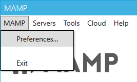
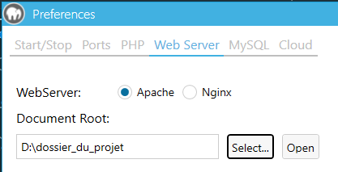

### Projet de développement géomatique, réalisé en février 2024.

## Contexte :
L'objectif principal de ce projet est de développer un outil permettant de co-visualiser des flux WMS. Les flux WMS permettent d'accéder à des données géographiques, telles que des cartes ou des orthophotos.

Les contraintes suivantes ont été imposées par le commanditaire du projet :

- L’outil développé devra être très facilement déployable et ne requérir aucune installation 
préalable.

- L’outil devra être très facilement actualisable. En particulier, les flux accessibles peuvent 
changer d’adresse au cours du temps, ou de nouveaux flux peuvent arriver : la 
documentation et l’organisation du code devra permettre une mise à jour simplissime.

- Les flux accessibles devront pouvoir être organisés au cas où ils deviendraient nombreux, et 
cela devra être changeable facilement (par exemple regroupés par catégories comme photos 
/ cartes… ou présent / historique)

## Mise en place :
Pour répondre aux besoin de ce projet, l'outil a été imaginé de la manière suivante :
- Développement de deux pages en HTML/CSS, présentant deux manières de visualiser les données (plusieurs flux visualisables côte à côte / deux flux séparés par une glissière verticale).

- Utilisation du framework [Vue.js](https://fr.vuejs.org/), permettant un affichage et une mise à jour dynamique des flux séléctionnés en direct, mais également de changer la mise en page pour adapter l'outil en fonction du nombre de flux à afficher.

- Utilisation de la bibliothèque JavaScript [Leaflet](https://leafletjs.com), compatible avec les flux WMS, TMS et XYZ. La principale demande du commanditaire étant de pouvoir afficher des flux WMS, il ne s'est pas imposé d'utiliser d'autres services plus avancés (mais plus complexes) tel que OpenLayers par exemple.

## Plugins Leaflet
Certaines fonctionnalités du projet ont déjà été développés par la communauté Leaflet. Notamment, le premier plugin utilisé [Leaflet.Sync](https://github.com/jieter/Leaflet.Sync), permet de réaliser la première fonctionnalité attendue du projet : la synchronisation des cartes. En effet, ce plugin permet de transférer les évènements de zoom et de déplacement sur une carte, vers d'autres cartes sur une même page.
Le deuxième plugin utilisé, [leaflet-control-swipe](https://github.com/frogcat/leaflet-control-swipe), permet l'implantation d'une glissière verticale, évoluant de manière latérale sur une carte Leaflet, permettant la visualisation de deux couches superposées.

## Mise à jour des flux :
Une des contraintes du projet étant de rendre la mise à jour facile pour le commanditaire, l'architecture du fichier listeFlux.json est détaillé ici.

Ce fichier recense les flux WMS/XYZ/TMS utilisé dans l'application Visionneuse.
5 attributs sont associés à chaque flux :
- **url** : lien du service WMS/XYZ/TMS du flux.
Les liens XYZ et TMS sont des liens prêts à l'emploi, il se reconnaissent par leur fin, suivant souvent ce modèle : *{z}/{x}/{y}.png*

Les liens WMS sont plus complexes et prennent beaucoup de paramètres en compte. Pour utiliser un service WMS, il est demandé de seulement renseigner l'URL du service. Voici un exemple de lien WMS complet :

https://data.geopf.fr/wms-r/wms?service=WMS&request=GetMap&layers=ORTHOIMAGERY.ORTHOPHOTOS&styles=&format=image%2Fjpeg&transparent=false&version=1.3.0&width=256&height=256&crs=EPSG%3A3857&bbox=152109.68628750078,6456024.283022561,152262.5603440711,6456177.15707913

Seule la partie précédant *?service=WMS...* est à renseigner dans l'attribut url du flux.
Ici, *https://data.geopf.fr/wms-r/wms*.

- **service** : 3 valeurs sont possibles: WMS, XYZ ou TMS.
Certains sites peuvent confondre XYZ et TMS lorsqu'ils renseignent la nature du flux. Si des tuiles sont affichées de manière bizarre, changer XYZ par TMS et vice-versa peut résoudre le problème.

- **couche_wms** : est un attribut à renseigner, uniquement si le flux est un flux WMS. En effet, un service WMS peut diffuser une multitude de couches. Ainsi, la couche (ou layer) doit être renseignée, afin de préciser quel couche du flux WMS est à afficher.

Exemple : le service *https://data.geopf.fr/wms-r/wms* diffuse le plan IGN mais également des orthophotos (et des dizaines d'autres thématiques).

Si l'on reprend le lien suivant :

https://data.geopf.fr/wms-r/wms?service=WMS&request=GetMap&layers=ORTHOIMAGERY.ORTHOPHOTOS&styles=&format=image%2Fjpeg&transparent=false&version=1.3.0&width=256&height=256&crs=EPSG%3A3857&bbox=152109.68628750078,6456024.283022561,152262.5603440711,6456177.15707913

La couche à afficher est renseigné après le paramètre *layers* (*&layers=*). Ici, le flux WMS affiche la couche *ORTHOIMAGERY.ORTHOPHOTOS*.

- **categorie** : est un attribut permettant de trier les flux dans l'interface de la visionneuse.

**Attention : pour que l'outil puisse fonctionner, le flux OpenStreetMaps ne doit pas être supprimé, car c'est le flux affiché par défaut lors de l'initialisation du site.**

## Installation sur un serveur local
Pour déployer ce site sur un serveur local:
- Installer la dernière version de [MAMP](https://www.mamp.info/en/downloads/).
- Télécharger la [dernière version du projet](https://github.com/EstebanAugustin/visionneuse_wms/archive/refs/heads/main.zip).
- Dans MAMP:
Aller dans les préférences

Modifier "Document Root" pour le dossier du projet

- Lancer le serveur
- Se rendre à l'adresse http://localhost
